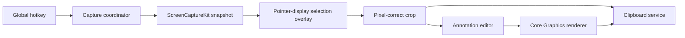

# Fast macOS Screenshot App

Native, menu-bar-only macOS app in Swift/AppKit. `Cmd+Shift+X` opens a Flameshot-style region selector on the monitor containing the pointer. The selected image is copied immediately, then recopied whenever an annotation is completed.

The point of this project is speed and a hard memory ceiling. Flameshot can sit at 300 MB and climb toward 3 GB. Snap must not do that. A full-display capture may briefly cost one 4-byte-per-pixel buffer. After selection, only the crop remains. After the clipboard write and editor close, Snap must return near its idle baseline and retain no screenshot pixels.

## Scope and fixed decisions

- Native Swift/AppKit menu-bar application targeting macOS 14+. It has no normal Dock window and uses no Electron or web runtime.
- The repository uses Swift Package Manager, not an Xcode project. Development uses `swift build` and `swift test` from Command Line Tools.
- [`scripts/build-app.sh`](scripts/build-app.sh) creates `dist/Snap.app`, supplies its `Info.plist`, and applies a local ad-hoc signature. The app bundle is the normal development launch target because macOS privacy permission is tied to its stable bundle identifier.
- `Cmd+Shift+X` globally starts capture. The implementation uses the Carbon `RegisterEventHotKey` API so it does not require Accessibility permission.
- Each invocation captures only the display containing the mouse pointer, then shows the area-selection overlay on that display. This preserves Flameshot-style drag selection while avoiding full-resolution buffers for unused monitors.
- The selected image is copied immediately. Completed annotations replace the clipboard image on mouse-up; pointer movement never triggers image encoding or clipboard writes.
- Clipboard writes are eager, never promised or lazy. As soon as `NSPasteboard` accepts the bytes, Snap releases its encoded PNG and render buffer; the pasteboard process owns the clipboard copy.
- While the annotation editor remains open, Snap necessarily retains one cropped base image so it can display and re-render annotations. When the editor closes, it releases that image, all annotations, windows, layers, tasks, and coordinator references immediately.
- Tools are a red arrow, a red outline rectangle, and an opaque black privacy rectangle. The compact toolbar also exposes undo and done.
- `A`, `R`, and `B` select tools. `Cmd+Z` undoes, `Delete` removes a selected annotation if selection is implemented, `Enter` finishes, and `Esc` cancels.
- Clipboard-only MVP: no file saving, cloud upload, OCR, history, accounts, login item, App Store packaging, or preferences UI.

## Architecture

- [`Sources/Snap/App/AppDelegate.swift`](Sources/Snap/App/AppDelegate.swift) owns the menu-bar item and application lifecycle.
- [`Sources/Snap/App/CaptureCoordinator.swift`](Sources/Snap/App/CaptureCoordinator.swift) is the only state machine. Its states are idle, requesting permission, capturing, selecting, and annotating. A hotkey received outside idle is ignored.
- [`Sources/Snap/Capture/ScreenCaptureService.swift`](Sources/Snap/Capture/ScreenCaptureService.swift) uses ScreenCaptureKit to create one immutable image for the display containing the mouse pointer before the overlay appears.
- [`Sources/Snap/Capture/ScreenGeometry.swift`](Sources/Snap/Capture/ScreenGeometry.swift) centralizes conversions between AppKit global points, display-local points, and image pixels. Views must not duplicate conversion arithmetic.
- [`Sources/Snap/Selection/SelectionOverlayController.swift`](Sources/Snap/Selection/SelectionOverlayController.swift) owns one borderless `NSWindow` on the captured display and returns one normalized selection.
- [`Sources/Snap/Annotation/AnnotationDocument.swift`](Sources/Snap/Annotation/AnnotationDocument.swift) stores the base image, ordered annotation values, current tool, and undo history.
- [`Sources/Snap/Annotation/AnnotationCanvasView.swift`](Sources/Snap/Annotation/AnnotationCanvasView.swift) handles pointer interaction and lightweight previews.
- [`Sources/Snap/Annotation/ImageRenderer.swift`](Sources/Snap/Annotation/ImageRenderer.swift) is the single authoritative Core Graphics compositor used by both tests and clipboard output.
- [`Sources/Snap/Services/ClipboardService.swift`](Sources/Snap/Services/ClipboardService.swift) performs an eager PNG write to `NSPasteboard`, prevents stale asynchronous renders from winning, and retains no image or encoded data after the write returns.

## Memory and lifetime rules

These are release blockers, not polish.

- Capture exactly one display: the one containing `NSEvent.mouseLocation`.
- Keep exactly one full-display image allocation. Views must display that same `CGImage` without converting it to `NSImage`, `NSBitmapImageRep`, or another full-size copy.
- On mouse-up, deep-copy only the selected pixels into a tightly sized image, then release the full-display image immediately so the crop cannot retain its backing storage.
- Encode one PNG and write it eagerly. Do not retain duplicate PNG and TIFF payloads unless compatibility testing proves PNG-only clipboard data is insufficient.
- `ClipboardService` is stateless: it receives an image for one write and stores no `CGImage`, `NSImage`, `Data`, callback, task, or pasteboard owner object afterward.
- Wrap cropping and encoding in explicit autorelease pools. After the write returns, nil every temporary reference to the full-display image, crop context, encoded PNG, and overlay layer contents.
- Undo stores annotation values, not bitmap snapshots.
- On `Enter` or `Esc`, cancel pending render tasks, clear layer contents and delegates, remove event monitors, close the editor window, empty the annotation document, and return the coordinator to idle. Add debug assertions that these session objects deinitialize.
- After editor close, Snap must retain no screenshot pixels at all. Only the external pasteboard copy may remain.
- Fifty capture/select/annotate/close cycles must leave zero live session objects and no definitely lost Snap-owned allocations. Passing functional tests is insufficient if this gate fails.

## Phase 1 — CLI-native application foundation

**Recommended model:** Grok 4.6 Extra High is sufficient.

Create [`Package.swift`](Package.swift), [`Sources/Snap/main.swift`](Sources/Snap/main.swift), [`Sources/Snap/App/AppDelegate.swift`](Sources/Snap/App/AppDelegate.swift), [`Sources/Snap/App/CaptureCoordinator.swift`](Sources/Snap/App/CaptureCoordinator.swift), [`Sources/Snap/Services/GlobalHotKey.swift`](Sources/Snap/Services/GlobalHotKey.swift), [`Resources/Info.plist`](Resources/Info.plist), and [`scripts/build-app.sh`](scripts/build-app.sh).

Implementation requirements:

- Start `NSApplication` programmatically and set accessory activation policy so the app is menu-bar-only.
- Provide menu items for Capture and Quit.
- Register and unregister `Cmd+Shift+X`; route every trigger through `CaptureCoordinator`.
- Define the coordinator state machine now, but use a visible temporary overlay or log callback as the capture action until Phase 2.
- Build a release executable with SwiftPM, assemble the `.app` directory, copy resources, and ad-hoc sign it. Do not invoke `xcodebuild`.

Completion gate:

- `swift build` and `swift test` pass.
- `scripts/build-app.sh` produces a launchable `dist/Snap.app`.
- The menu-bar icon appears, the app has no Dock icon, the shortcut reaches the coordinator once, repeat triggers are suppressed while busy, and Quit unregisters the hotkey.
- The idle process performs no polling or timers and consumes effectively 0% CPU.

## Phase 2 — capture and coordinate foundation

**Recommended model:** Use GPT-5.6 Sol Medium or Claude Opus 5 Thinking High. This is the first high-risk phase because ScreenCaptureKit, Retina scaling, and displays with negative global coordinates are easy to implement incorrectly.

Create [`Sources/Snap/Capture/ScreenCaptureService.swift`](Sources/Snap/Capture/ScreenCaptureService.swift), [`Sources/Snap/Capture/CapturedDisplay.swift`](Sources/Snap/Capture/CapturedDisplay.swift), [`Sources/Snap/Capture/ScreenGeometry.swift`](Sources/Snap/Capture/ScreenGeometry.swift), and focused tests under [`Tests/SnapTests/Capture`](Tests/SnapTests/Capture).

Implementation requirements:

- Check Screen Recording access and request it only in direct response to capture. If denied, show one actionable alert that opens no browser and explains the System Settings path.
- Resolve the display containing `NSEvent.mouseLocation`, then capture only that display once with ScreenCaptureKit before creating the overlay window.
- Record the display ID, AppKit frame in global points, backing scale, pixel dimensions, and immutable `CGImage` together.
- Make all coordinate conversion functions pure and testable. Cover a Retina primary display, a non-Retina secondary display, displays left or above the primary origin, and normalized reverse-direction drags.
- Keep capture work asynchronous and keep all AppKit window work on the main actor.
- Keep exactly one full-display image allocation. Views must display the same `CGImage` without converting it to `NSImage`, `NSBitmapImageRep`, or another full-size copy.

Completion gate:

- Unit tests prove point-to-pixel crops remain within image bounds and select the expected pixels for mixed layouts.
- Permission denial returns the coordinator to idle.
- One hotkey invocation captures only the pointer’s current display exactly once without displaying UI in the screenshot.

## Phase 3 — fast selection and immediate clipboard

**Recommended model:** GPT-5.6 Sol Medium or Claude Opus 5 Thinking High is preferred. This phase joins event handling with the coordinate work from Phase 2.

Create [`Sources/Snap/Selection/SelectionOverlayController.swift`](Sources/Snap/Selection/SelectionOverlayController.swift), [`Sources/Snap/Selection/SelectionOverlayView.swift`](Sources/Snap/Selection/SelectionOverlayView.swift), [`Sources/Snap/Selection/Selection.swift`](Sources/Snap/Selection/Selection.swift), and [`Sources/Snap/Services/ClipboardService.swift`](Sources/Snap/Services/ClipboardService.swift).

Implementation requirements:

- Present one borderless window at screen-saver level on the pointer’s display, backed directly by the already-frozen display image.
- Dim the display outside the active region. Show a crisp red selection border and pixel dimensions while dragging.
- Normalize drags in every direction, enforce a small minimum region, constrain the drag to the captured display, and handle `Esc`.
- On mouse-up, dismiss the overlay and deep-copy only the selected pixels into a tightly sized image. Release the full-display image immediately so the cropped image cannot retain its backing storage.
- Encode one PNG representation and place it on `NSPasteboard` immediately. Do not retain duplicate PNG and TIFF payloads unless compatibility testing proves PNG-only clipboard data is insufficient.
- Wrap cropping and encoding in explicit autorelease pools. After the eager clipboard write succeeds, nil every temporary reference to the full-display image, crop context, encoded PNG, and overlay layer contents.
- Pass the exact cropped `CGImage` to the next phase through the coordinator. Do not recapture the screen after selection.

Completion gate:

- The clipboard image dimensions and corner pixels match the selected region in automated crop tests.
- Manual checks pass when the pointer starts on every connected display, including a non-primary display and mixed scaling.
- Cancel leaves the existing clipboard untouched and always returns to idle.
- The full-display buffer is released within 500 ms after selection or cancellation.

## Phase 4 — annotation editor and live clipboard

**Recommended model:** Grok 4.6 Extra High is sufficient. A stronger model is optional for visual polish.

Create the files under [`Sources/Snap/Annotation`](Sources/Snap/Annotation) plus tests under [`Tests/SnapTests/Annotation`](Tests/SnapTests/Annotation).

Implementation requirements:

- Open a borderless annotation window showing the cropped image at an appropriate on-screen size without changing its underlying pixel dimensions.
- Add a compact floating toolbar for arrow, outline rectangle, privacy block, undo, and done. Default to the arrow tool.
- Store annotations in image-space coordinates so window resizing or display scale never alters exported geometry.
- Draw a lightweight vector preview during drag. Commit one annotation on mouse-up, push one undo entry, render off the main thread, then replace the clipboard contents.
- Draw red arrows with consistent shaft width and arrowhead geometry, red rectangles with a fixed stroke width, and privacy blocks as fully opaque black rectangles.
- Use a monotonically increasing render generation so a slow earlier render cannot overwrite a newer clipboard result.
- `Enter` keeps the latest clipboard image and closes. `Esc` closes without rolling the clipboard back to the pre-capture value.
- Retain only the cropped base image, small vector annotation values, and at most one in-progress output buffer. Undo stores annotation values rather than bitmap snapshots.
- Use autorelease pools around image encoding and clear temporary render buffers as soon as `NSPasteboard` accepts the PNG.
- `ClipboardService` must be stateless: it receives an image for one write and stores no `CGImage`, `NSImage`, `Data`, callback, task, or pasteboard owner object afterward.
- On `Enter` or `Esc`, cancel pending render tasks, clear layer contents and delegates, remove event monitors, close the editor window, empty the annotation document, and return the coordinator to idle. Add debug assertions that these session objects deinitialize.

Completion gate:

- Unit tests cover reverse drags, arrowhead geometry, annotation ordering, undo, generation cancellation, and known-pixel compositor output.
- Each tool updates the clipboard only after mouse-up.
- Rapidly creating and undoing annotations never leaves stale content in the clipboard.

## Phase 5 — integration, performance, and packaging

**Recommended model:** Grok 4.6 Extra High is sufficient for test execution and fixes. Use GPT-5.6 Sol Medium or Claude Opus 5 Thinking High only if mixed-display defects remain.

Implementation requirements:

- Add coordinator transition tests and integration seams for hotkey-to-capture, capture-to-selection, selection-to-editor, cancel, permission failure, and repeated invocation.
- Add `os_signpost` intervals around hotkey-to-snapshot, snapshot-to-overlay, mouse-up-to-first-clipboard, and annotation-mouse-up-to-clipboard.
- Remove debug output, verify failure paths close all windows, and ensure capture image memory is released when returning to idle.
- Measure resident memory at idle, during full-display selection, during annotation, and after closing. Add a repeat-capture stress run to detect retained images or windows.
- Add debug-only lifetime counters or weak-reference probes for capture sessions, overlay controllers, editor controllers, documents, views, and render tasks. Every counter must return to zero after the editor closes.
- Run the repeat-capture stress test under the macOS `leaks` command when available. Treat any definitely lost allocation rooted in Snap code, any surviving session object, or monotonic resident-memory growth as a release blocker.
- Keep local packaging ad-hoc signed. Treat Developer ID signing, notarization, DMG creation, and App Store release as a separate future phase that may require full Xcode tooling and Apple credentials.

Completion gate:

- `swift test` and a clean release build pass.
- Manual matrix covers single display, pointer-based capture on every monitor, Retina/mixed scale, displays with negative origins, Spaces, a full-screen app, denied then granted permission, repeated rapid captures, and all keyboard controls.
- Target latency is under 300 ms from hotkey to visible frozen overlay, under 100 ms from completed snapshot to overlay, and under 50 ms from mouse-up to clipboard refresh for an ordinary region.
- Target idle resident memory is below 35 MB after launch settles. During selection, memory should be no more than one 4-byte-per-pixel display buffer plus 35 MB overhead. During annotation, it should be bounded by the cropped base image, one output buffer, one encoded PNG, plus 35 MB overhead.
- After the editor closes, resident memory must return to within 10 MB of its pre-capture baseline within two seconds. Fifty repeated capture/cancel cycles must not show monotonically increasing resident memory.
- Immediately after each clipboard write, Snap must retain no encoded PNG or completed render buffer. After editor close, it must retain no screenshot pixels at all; only the external pasteboard copy may remain.
- Fifty capture/select/annotate/close cycles must leave zero live session objects and no definitely lost Snap-owned allocations. Passing the functional tests is insufficient if this gate fails.
- Record actual latency and memory measurements in [`README.md`](README.md) instead of hiding misses.

## Handoff between context windows

For each new context, provide the agent this plan and ask it to implement exactly one phase. The agent must first inspect the current repository and run the previous phase’s completion commands. It should not begin the requested phase if the prior completion gate is broken; it should report or repair only the blocking regression. At the end, it must run that phase’s checks and list any manual checks that still require you.

## Phase status

| Phase | Status |
| --- | --- |
| 1. CLI-native application foundation | Complete |
| 2. Capture and coordinate foundation | Implemented; manual display checks pending |
| 3. Fast selection and immediate clipboard | Implemented; manual display and memory checks pending |
| 4. Annotation editor and live clipboard | Implemented; manual visual/latency checks pending |
| 5. Integration, performance, and packaging | Implemented; interactive display/latency/50-cycle `leaks` pending. Idle `ps` RSS is 37 MB vs the 35 MB target. |
